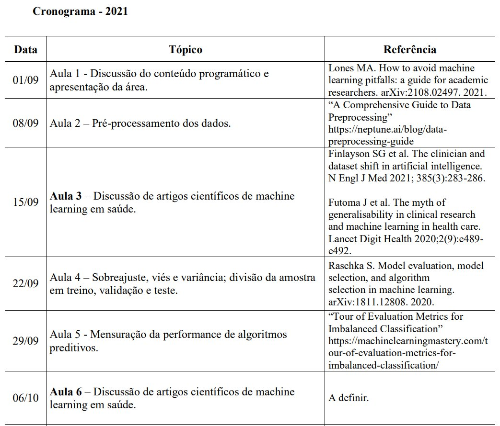
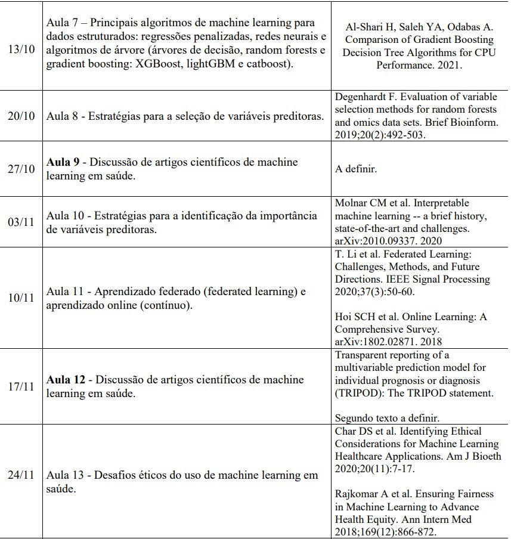

#statistics #data_science #machine_learning

> MAS SE É MACHINE LEARNING NÃO DEVIÃO SER AS MÁQUINA APRENDENDO AO INVÉS DOS ALUNO, NO YOUTUBE??? - [RaUL_AMDERLAINE](https://twitter.com/RaUL_AMDERLAINE/status/1433499972536881154)

- [Disciplina Machine Learning para Predições em Saúde (EPI5717) - Aula 1](https://www.youtube.com/watch?v=0G3GN2su2Mc)

- [Disciplina Machine Learning para Predições em Saúde (EPI5717) - Aula 2](https://www.youtube.com/watch?v=1PfyDRbE8Zw)

- [Disciplina Machine Learning para Predições em Saúde (EPI5717) - Aula 3](https://www.youtube.com/watch?v=3V6bORazxWw)

- [Disciplina Machine Learning para Predições em Saúde (EPI5717) - Aula 4](https://www.youtube.com/watch?v=wFw4mZLZcgU)

- [Disciplina Machine Learning para Predições em Saúde (EPI5717) - Aula 5](https://www.youtube.com/watch?v=rO9Ks173Wiw)

- [Disciplina Machine Learning para Predições em Saúde (EPI5717) - Aula 6](https://www.youtube.com/watch?v=LZPFh8HWSYg)