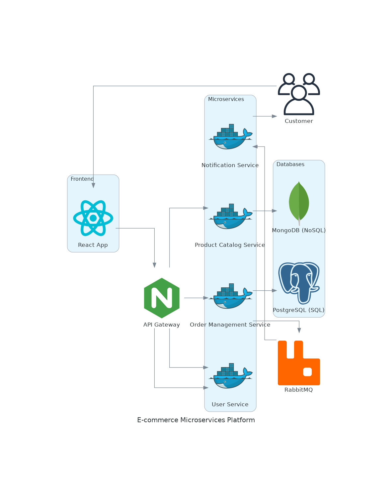
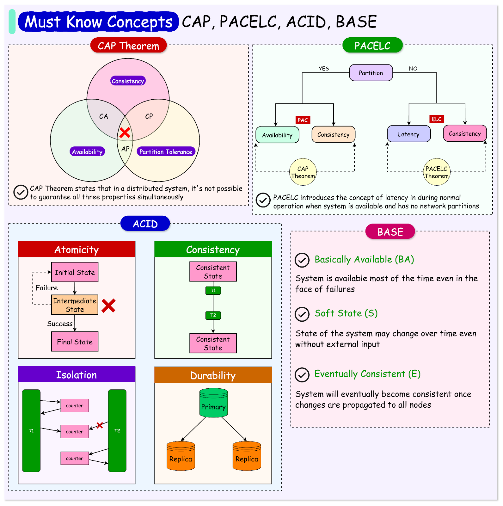

# Sistema 1: E-commerce Microservices Platform

[Repositorio Github](https://github.com/GuidoBR/ecommerce-microservices)

## Objetivos

Aprender conceitos de backend, frontend e DevOps desenvolvendo um sistema full-stack.

- Microservices, containerization, REST APIs, SQL/NoSQL databases, message queues, system design.
- Github Actions, Project Management

## Descrição técnica do projeto

**Overview:**
Build a small e-commerce platform with services such as:

- **Product Catalog:** Uses a NoSQL database (e.g., MongoDB) to store product information.
- **Order Management:** Uses SQL (e.g., PostgreSQL) to store orders and transactions.
- **User Service:** Handles authentication (JWT) and user profiles.
- **Notification Service:** Sends emails or SMS using message queues (e.g., RabbitMQ or Kafka).

**Tasks for the mentee:**

- Deploy microservices using **Docker**.
- Set up message queues to notify users of successful orders.
- Integrate SQL for order management and NoSQL for the product catalog.
- Introduce **API gateways** for communication between services.

## Semana 1

### Tarefa
- Implementar serviço de produtos (API em Django Rest Framework, CRUD, banco de dados NoSQL)

### Teoria

- [SQL vs NoSQL](https://medium.com/@abhirup.acharya009/sql-vs-nosql-choosing-the-right-database-model-for-your-business-needs-66aa39199c55)
- [API Gateway vs Load Balancer](https://www.moesif.com/blog/technical/api-development/API-Gateway-VS-Load-Balancer/)
- [A simple guide to configure Nginx as an API Gateway](https://medium.com/@nirmalkumar30/a-simple-guide-to-configure-nginx-as-an-api-gateway-684924cd51d0)
- [Docker curriculum](https://docker-curriculum.com/)
- [Microsserviços Prontos Para a Produção: Construindo Sistemas Padronizados em uma Organização de Engenharia de Software](https://www.amazon.com.br/Microsservi%C3%A7os-Prontos-Para-Produ%C3%A7%C3%A3o-Padronizados/dp/8575226215)

## Semana 2

### Tarefa

- Acessar o console do MongoDB localmente e brincar fazendo queries.
- Implementar frontend de produtos (projeto React, CRUD usando a api criada na primeira semana)
- Usar docker para toda a aplicação (container para o serviço de produtos, pro frontend, pro banco de dados)

### Teoria

- [CAP Theorem Simplified](https://www.youtube.com/watch?v=BHqjEjzAicA)
- [ACID Databases](https://www.freecodecamp.org/news/acid-databases-explained/#:~:text=ACID%20stands%20for%20Atomicity%2C%20Consistency,guarantees%20out%20of%20the%20box.)
- [ACID vs BASE](https://aws.amazon.com/compare/the-difference-between-acid-and-base-database/)
- [Normalização em banco de dados](https://www.alura.com.br/artigos/normalizacao-banco-de-dados-estrutura?srsltid=AfmBOoomdREOxWZ15bFoRScZ-j8zrGJ-yJHuM51VjP-6gwqx9yJR2h0P)
- [Dockerfile vs. Docker Compose: What You Should Know](https://www.techopsexamples.com/p/dockerfile-vs-docker-compose-what-you-should-know)
- [ReactJS Key Concepts](https://www.freecodecamp.org/news/learn-react-key-concepts/#heading-key-concepts-to-understand-in-react)
- [10 Core Concepts You Need to Know About React](https://payalpaul2436.medium.com/10-main-core-concept-you-need-to-know-about-react-303e986e1763)
- [Microsserviços Prontos Para a Produção: Construindo Sistemas Padronizados em uma Organização de Engenharia de Software](https://www.amazon.com.br/Microsservi%C3%A7os-Prontos-Para-Produ%C3%A7%C3%A3o-Padronizados/dp/8575226215)