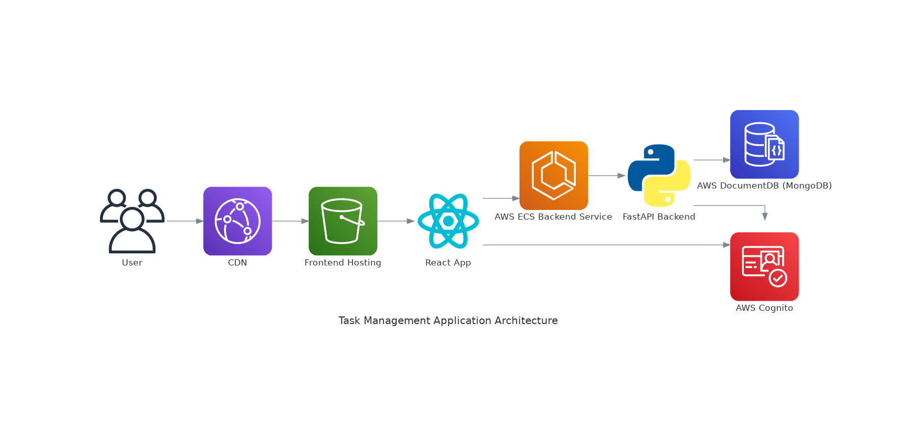

# Sistema 1: E-commerce Microservices Platform

## Objetivos

Aprender conceitos de backend, frontend e DevOps desenvolvendo um sistema full-stack.

- Microservices, containerization, REST APIs, SQL/NoSQL databases, message queues, system design.
- Github Actions, Project Management

## Descrição técnica do projeto


**Overview:**
Build a small e-commerce platform with services such as:

- **Product Catalog:** Uses a NoSQL database (e.g., MongoDB) to store product information.
- **Order Management:** Uses SQL (e.g., PostgreSQL) to store orders and transactions.
- **User Service:** Handles authentication (JWT) and user profiles.
- **Notification Service:** Sends emails or SMS using message queues (e.g., RabbitMQ or Kafka).

**Tasks for the mentee:**

- Deploy microservices using **Docker**.
- Set up message queues to notify users of successful orders.
- Integrate SQL for order management and NoSQL for the product catalog.
- Introduce **API gateways** for communication between services.

## Semana 1

### Tarefa
- Implementar serviço de produtos (API em Django Rest Framework, CRUD, banco de dados NoSQL)

### Teoria

- [SQL vs NoSQL](https://medium.com/@abhirup.acharya009/sql-vs-nosql-choosing-the-right-database-model-for-your-business-needs-66aa39199c55)
- [API Gateway vs Load Balancer](https://www.moesif.com/blog/technical/api-development/API-Gateway-VS-Load-Balancer/)
- [A simple guide to configure Nginx as an API Gateway](https://medium.com/@nirmalkumar30/a-simple-guide-to-configure-nginx-as-an-api-gateway-684924cd51d0)
- [Docker curriculum](https://docker-curriculum.com/)
- [Microsserviços Prontos Para a Produção: Construindo Sistemas Padronizados em uma Organização de Engenharia de Software](https://www.amazon.com.br/Microsservi%C3%A7os-Prontos-Para-Produ%C3%A7%C3%A3o-Padronizados/dp/8575226215)

## Semana 2

### Tarefa

- Acessar o console do MongoDB localmente e brincar fazendo queries.
- Implementar frontend de produtos (projeto React, CRUD usando a api criada na primeira semana)
- Usar docker para toda a aplicação (container para o serviço de produtos, pro frontend, pro banco de dados)

### Teoria


- [CAP Theorem Simplified](https://www.youtube.com/watch?v=BHqjEjzAicA)
- [ACID Databases](https://www.freecodecamp.org/news/acid-databases-explained/#:~:text=ACID%20stands%20for%20Atomicity%2C%20Consistency,guarantees%20out%20of%20the%20box.)
- [ACID vs BASE](https://aws.amazon.com/compare/the-difference-between-acid-and-base-database/)
- [Normalização em banco de dados](https://www.alura.com.br/artigos/normalizacao-banco-de-dados-estrutura?srsltid=AfmBOoomdREOxWZ15bFoRScZ-j8zrGJ-yJHuM51VjP-6gwqx9yJR2h0P)
- [Dockerfile vs. Docker Compose: What You Should Know](https://www.techopsexamples.com/p/dockerfile-vs-docker-compose-what-you-should-know)
- [10 Core Concepts You Need to Know About React](https://payalpaul2436.medium.com/10-main-core-concept-you-need-to-know-about-react-303e986e1763)
- [Microsserviços Prontos Para a Produção: Construindo Sistemas Padronizados em uma Organização de Engenharia de Software](https://www.amazon.com.br/Microsservi%C3%A7os-Prontos-Para-Produ%C3%A7%C3%A3o-Padronizados/dp/8575226215)

## Semana 3

### Tarefa

- Acessar o console do MongoDB localmente e brincar fazendo queries.
- Usar docker para toda a aplicação (container para o serviço de produtos, pro frontend, pro banco de dados)
- Criar (backend e frontend) order management service
	- Com docker, backend em FastAPI, PostgreSQL como banco de dados. 

### Teoria

- [Database Types](https://www.linkedin.com/posts/tauseeffayyaz_%F0%9D%90%83%F0%9D%90%9A%F0%9D%90%AD%F0%9D%90%9A%F0%9D%90%9B%F0%9D%90%9A%F0%9D%90%AC%F0%9D%90%9E-%F0%9D%90%93%F0%9D%90%B2%F0%9D%90%A9%F0%9D%90%9E%F0%9D%90%AC-key-value-activity-7261767413392699392-NRLK/?utm_source=share&utm_medium=member_desktop)
- [7 must-know strategies to scale your database](https://www.linkedin.com/feed/update/urn:li:activity:7261693073129115648/?utm_source=share&utm_medium=member_android)
- [Locust load testing](https://www.linode.com/docs/guides/load-testing-with-locust/)
- [Microsserviços Prontos Para a Produção: Construindo Sistemas Padronizados em uma Organização de Engenharia de Software](https://www.amazon.com.br/Microsservi%C3%A7os-Prontos-Para-Produ%C3%A7%C3%A3o-Padronizados/dp/8575226215)


## Semana 4

### Tarefa

- Fazer load-testing da aplicação localmente
- Usar docker para toda a aplicação (container para o serviço de produtos, pro frontend, pro banco de dados)

### Teoria

- [Selecting a React Component Library, the Strategic Way](https://www.superblocks.com/blog/selecting-a-react-component-library-the-strategic-way)
- [What I Wish Someone Told Me About Postgres](https://challahscript.com/what_i_wish_someone_told_me_about_postgres)
- [How Amazon Scaled E-commerce Shopping Cart Data Infrastructure](https://newsletter.systemdesign.one/p/amazon-dynamo-architecture)
- [Everything You NEED to KNOW About Web Applications](https://www.youtube.com/watch?v=_higfXfhjdo)


## Semana 5


###  Tarefa

- Consertar docker
- Montar layout do site (usando alguma component library do react e/ou tailwind)

### Teoria
- [From laid off to hired: A Software Engineer’s guide](https://newsletter.eng-leadership.com/p/from-laid-off-to-hired-a-software)
- [Good software development habits](https://zarar.dev/good-software-development-habits/)
- [7 Mindsets That Are Slowing Down Your Career Growth](https://www.thecaringtechie.com/p/7-mindsets-that-are-slowing-down)

# Sistema 2: AWS - Site estático

## Semana 6

### Tarefa

- Deployar um site estático na AWS

### Teoria

- [AWS - Host a Static Website](https://aws.amazon.com/getting-started/hands-on/host-static-website/)

# Sistema 3: Task Management Application



### High-Level Overview
This project is a task management application designed to allow users to manage their daily tasks with features like adding, updating, deleting, and categorizing tasks. Each task can have a title, description, priority, deadline, and tags (e.g., "work," "personal"). Users will also be able to mark tasks as completed and filter tasks by category, deadline, or priority.

The system should be implemented using Python for the backend, React for the frontend, and deployed to AWS. It will focus on SOLID principles, proper API design, NoSQL database usage, and design patterns for maintainable and scalable code.

### Core Functionalities
#### User Authentication
- Register, login, and logout features using AWS Cognito.
- Secure the API with authentication tokens (JWT).
#### Task Management
- Add new tasks with details (title, description, priority, deadline, tags).
- Update or delete existing tasks.
- Mark tasks as completed.
- List tasks with filtering and sorting options (e.g., by priority, deadline, or tags).
#### Tags Management
- Allow users to define and assign tags for better categorization.
#### Task Insights
- Provide a summary of task statistics, such as the number of completed tasks and pending tasks grouped by priority or deadline.
### High-Level Architecture
#### Frontend (React)

- UI Framework: Use Material-UI or Tailwind CSS for styling.
- State Management: Use Context API or Redux for state management.

##### Features:
- A dashboard for managing tasks.
- Forms for adding/updating tasks.
- Filtering and sorting options for tasks.
- Authentication pages (login/register).

#### Backend (Python)

- Framework: Use FastAPI for a clean and simple API.
- Database: Use MongoDB (hosted on AWS DocumentDB) for storing tasks, users, and tags.

##### Features:
- RESTful APIs for CRUD operations.
- Input validation and error handling.
- Modularized codebase adhering to SOLID principles.

#### AWS Deployment
- Backend: Deploy as a containerized service using AWS ECS.
- Frontend: Host the React app on AWS S3 and use CloudFront for CDN.
- Database: Use AWS DocumentDB (MongoDB).
- Authentication: Manage using AWS Cognito.

### Focus on SOLID Principles
- **Single Responsibility**: Separate concerns into services: authentication, task management, and tags.
- **Open/Closed Principle**: Design services and models to allow extensions without modifying the existing codebase.
- **Liskov Substitution**: Use interfaces or abstract classes where necessary (e.g., for repository pattern).
- **Interface Segregation**: Keep APIs focused on single responsibilities (e.g., task endpoints don’t handle user-related operations).
- **Dependency Inversion**: Use dependency injection for database access, allowing for easier testing and mocking.

### Design Patterns
- **Repository Pattern**: Abstract MongoDB operations into a repository to separate database logic from business logic.
- **Factory Pattern**: Use factories for creating tasks or tags with default values and validations.
- **Strategy Pattern**: Implement sorting and filtering using interchangeable strategies.

### AWS Services
- AWS ECS: Host the Python backend as a containerized service.
- AWS S3 + CloudFront: Serve the React frontend.
- AWS Cognito: Manage user authentication.
- AWS DocumentDB: Store tasks and tags in a MongoDB-compatible NoSQL database.
- AWS CloudWatch: Monitor logs and system performance.
- AWS IAM: Secure access to AWS resources.

## Semana 7


### Teoria

- [Linux Commands Every DevOps Engineer Must Know](https://linux-series.hashnode.dev/linux-commands-every-devops-engineer-must-know)
- [Big O Notation](https://www.geeksforgeeks.org/analysis-algorithms-big-o-analysis/)
- [SOLID: The First 5 Principles of Object Oriented Design](https://www.digitalocean.com/community/conceptual-articles/s-o-l-i-d-the-first-five-principles-of-object-oriented-design)
- [Design Patterns in Python](https://refactoring.guru/design-patterns/python)

### Tarefa

**Task 1**: Project Setup
**Goal**: Set up the foundational structure for both the backend and frontend projects.

**Backend (Python):**

Initialize a Python project using FastAPI or Flask.
Set up a virtual environment and install essential packages (fastapi, uvicorn, pymongo).
Create a basic API endpoint (/health) to verify the backend is running.
Write Dockerfile and configure for containerization.

**Frontend (React):**

Initialize a React project using create-react-app.
Set up project structure (components, pages, utils).
Create a basic homepage with a "Hello, World" message.

**Testing:**

Verify the frontend connects to the backend API.

## Semana 8


### Teoria

- [How To Build Web Apps using V0 + Claude AI + Cursor AI](https://www.youtube.com/watch?v=grc0YSEdUQY)
- [How I built a REAL app using Figma AI in 48 hrs! (ENTIRE UX/UI Process)](https://www.youtube.com/watch?v=tdvlxcSep54)

### Tarefa

**Task 2: User Authentication**
**Goal:** Implement user registration, login, and authentication using AWS Cognito.

- **Backend:**
  - Set up AWS Cognito and configure a user pool.
  - Create APIs for user registration and login.
  - Implement token validation middleware for securing APIs.
- **Frontend:**
  - Create React components for login and registration forms.
  - Integrate Cognito authentication using AWS Amplify or `amazon-cognito-identity-js`.
  - Display error messages for failed logins.
- **Testing:**
  - Verify user registration and login flows locally and ensure tokens are passed to secure backend APIs.

### Entrevista Técnica

#### Techical questions

##### 1. "Explain how you would implement a rate limiter using the a design  pattern in Python. How would this compare to other patterns you might use for the same problem?"

- How the Decorator pattern allows for separation of concerns
- Thread safety considerations
- Non-intrusive
- Reusable
- Composable with other decorators

```python
from functools import wraps
from time import time
from collections import defaultdict
import threading

def rate_limit(max_requests: int, window_seconds: int):
    """
    Rate limiting decorator that allows max_requests in window_seconds
    """
    lock = threading.Lock()
    requests = defaultdict(list)  # key: ip, value: list of timestamps

    def decorator(f):
        @wraps(f)
        def wrapped(request, *args, **kwargs):
            ip = request.client_ip  # assuming request has client_ip attribute
            
            with lock:
                # Clean old requests
                current = time()
                requests[ip] = [req_time for req_time in requests[ip] 
                              if current - req_time <= window_seconds]
                
                # Check if rate limit exceeded
                if len(requests[ip]) >= max_requests:
                    raise RateLimitExceeded("Too many requests")
                
                # Add new request timestamp
                requests[ip].append(current)
            
            return f(request, *args, **kwargs)
        return wrapped
    return decorator

# Usage example
@rate_limit(max_requests=100, window_seconds=60)
def some_api_endpoint(request):
    return {"status": "success"}
```


##### 2. "You're designing a social media platform's backend. Walk me through how you would choose between SQL and NoSQL databases for different components of the system, and what specific database types you would consider."

- NoSQL for relationship between users (graph database)
- NoSQL (e.g., MongoDB) for posts/content due to flexible schema requirements and high write throughput
- Redis for caching and session management
- Specific examples of when schema flexibility is worth trading off consistency
- Discussion of read/write patterns and scaling considerations

##### 3. "Explain the CAP theorem and provide a real-world example where you had to make tradeoffs between consistency, availability, and partition tolerance."

- Clear explanation that you can only guarantee two out of three properties
- Explanation that partition tolerance isn't optional in distributed systems
- Real example like choosing eventual consistency for news feed updates
- Understanding that CAP theorem tradeoffs exist on a spectrum
- Discussion of techniques like read-repair or vector clocks

##### 4. "You have a distributed system processing financial transactions. How would you ensure ACID properties are maintained, and what are the performance implications?"

- Detailed explanation of Atomicity, Consistency, Isolation, and Durability
- Discussion of distributed transactions and two-phase commit
- Performance implications of different isolation levels
- Mention of eventual consistency as an alternative
- Concrete examples of when to relax ACID properties

##### 5. "How would you implement authentication and authorization in a RESTful API? Walk through the security considerations."

- JWT structure and usage
- OAuth 2.0 flows
- Refresh token strategies
- CORS configuration
- Rate limiting
- Password hashing
- Session management
- Common security vulnerabilities

##### 6. "You notice that your API endpoints are becoming slower over time. Walk me through your debugging process and potential solutions."

- Systematic approach to identifying bottlenecks
- Tools they would use (APM, profilers, logs)
- Database query optimization
- Caching strategies
- Connection pooling
- N+1 query problems
- Resource scaling
- Monitoring and alerting setup

#### Behavioral Questions:

##### 1. "Tell me about a time when you had to make a significant technical decision that others disagreed with. How did you handle it?"

- Clear problem statement
- Data-driven decision making process
- How they built consensus
- Implementation challenges
- Lessons learned and outcomes

##### 2. "Describe a situation where you had to deal with technical debt. How did you approach it?"

- How they identified and measured the debt
- Strategy for addressing it incrementally
- How they convinced stakeholders
- Balance between new features and maintenance
- Long-term impact of their approach

##### 3. "Tell me about a time when you had to mentor someone who was struggling. What was your approach?"

- Assessment of the root causes
- Structured approach to improvement
- Specific examples of interventions
- Measuring progress
- Long-term outcomes

##### 4. "Describe a project that failed or had significant setbacks. What did you learn from it?"

- Honest assessment of what went wrong
- Their role in the situation
- How they adapted
- Specific learnings
- How they applied these lessons later

## Semana 9

### Pratica

Atenção - use o Free Tier da AWS!!!!

- Fazer deploy do backend no EC2
- Fazer deploy do frontend no Amplify
- Criar workflows no Github Actions: lint e teste.

### Teoria

- [Architectures of modern Front-end applications](https://blog.meetbrackets.com/architectures-of-modern-front-end-applications-8859dfe6c12e)

- [How to (and how not to) design REST APIs](https://github.com/stickfigure/blog/wiki/How-to-%28and-how-not-to%29-design-REST-APIs?&aid=recMRSdh6NSCDPlMu&_bhlid=ba1ddeb03c1fb7895283f46a68f6ea63aab98ec7)

- [Building personal software with Claude](https://blog.nelhage.com/post/personal-software-with-claude/?&aid=recF7xmVNtVZHMnWI&_bhlid=953910a4447d29ab86cf904b079b01e8d986f6d6)

- [How might AI change programming?](https://registerspill.thorstenball.com/p/how-might-ai-change-programming?aid=recrhsaxDDld8d74Y&_bhlid=0d1f33e033ee8156cf01e9a23bbdb74ac64a9f79)

- [Once You're Laid Off, You'll Never Be the Same Again](https://mertbulan.com/2025/01/26/once-you-are-laid-off-you-will-never-be-the-same-again/?utm_source=hackernewsletter&utm_medium=email&utm_term=fav)

- [Software development topics I've changed my mind on after 10 years in the industry](https://chriskiehl.com/article/thoughts-after-10-years?&aid=recc0l1cvkgs2T1vw&_bhlid=7849fa9b7db2bab34b324bd77d184ad9e3a4666a)

## Semana 10

### Teoria

- [O que não te contaram sobre virar programador](https://www.youtube.com/watch?v=RA6cUKX_4io)
- [To avoid being replaced by LLMs, do what they can't](https://www.seangoedecke.com/what-llms-cant-do/)
- [LLM Skills for devs](https://www.linkedin.com/posts/gustavoatrigos_ive-interviewed-100s-of-engineer-candidates-activity-7298752096277868545-hZUv/)
- [Como abordar recrutadores](https://www.linkedin.com/posts/silvatammy_tammyindica-dicas-activity-7297955554549731328-aFLw/)
- [Curso: Software Architecture & Design of Modern Large Scale Systems](https://www.udemy.com/course/software-architecture-design-of-modern-large-scale-systems/l)
